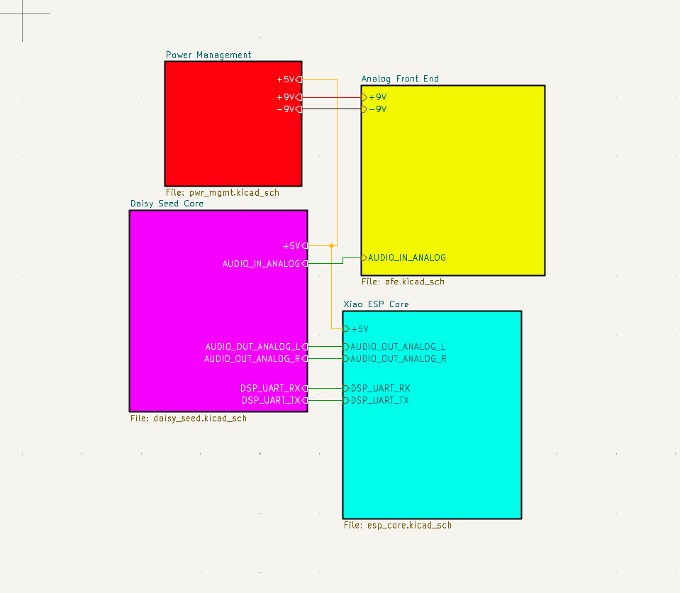
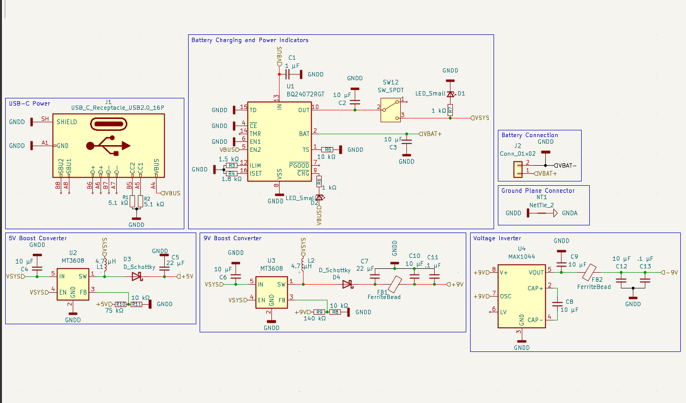
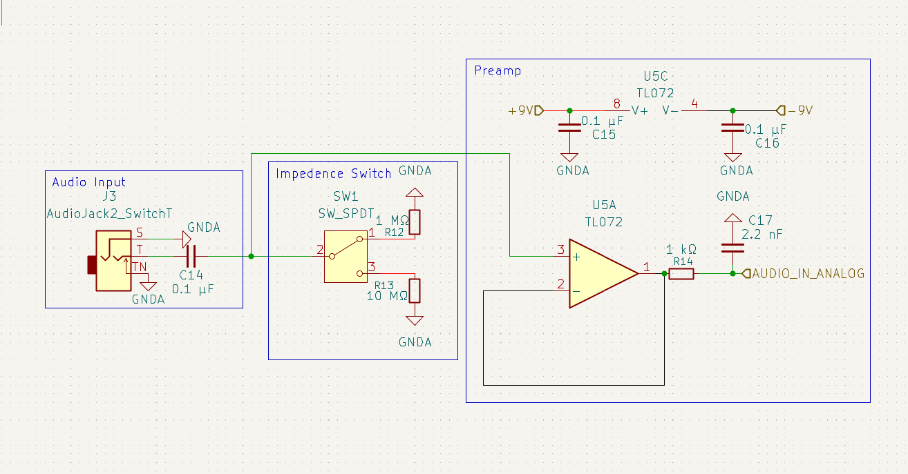
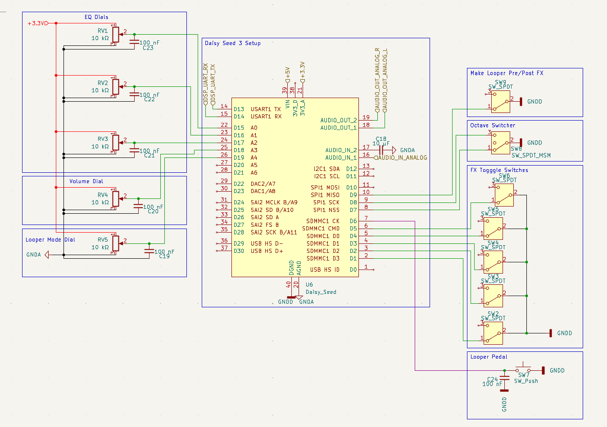
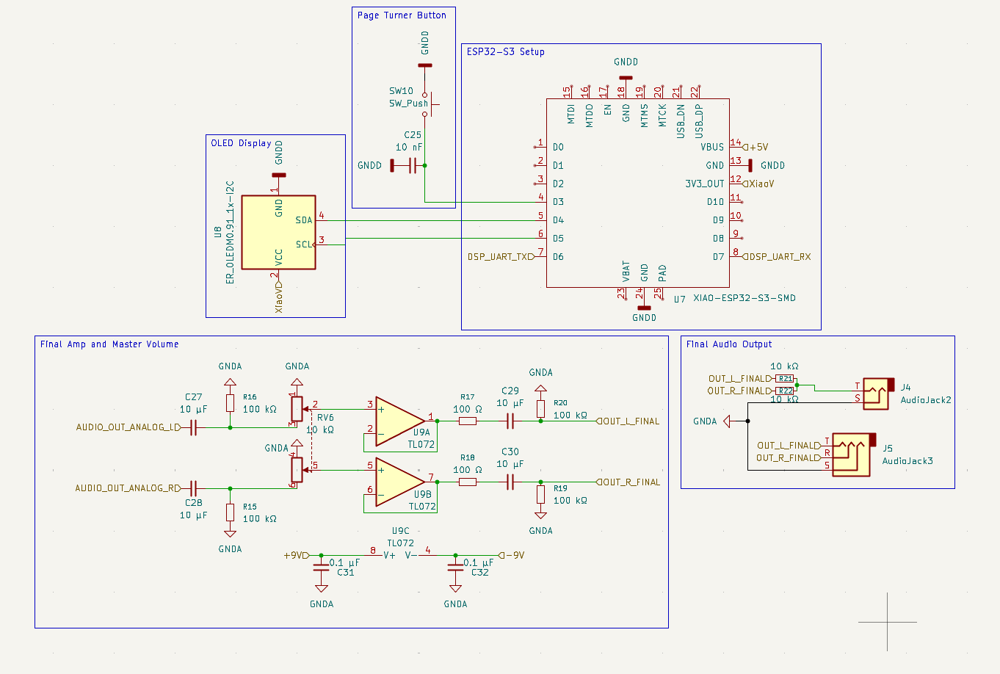
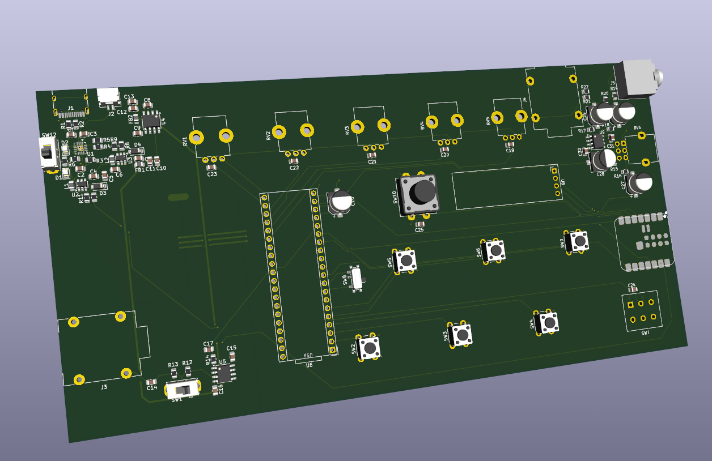

# V-ARC (WIP)
V-ARC is a multi-effects pedal, preamp, ble page turner, and looper designed for electric violin. It can also be used for other electric
instruments such as guitar. It runs on 2 separate controllers and includes a Lipo battery. It will be capable of being wirelessly reprogrammed for convienience,
and should have an app later in development so that settings can be tweaked or effects swapped without interacting with it. It is also going to feature MIDI conversion
and wireless playback in the future.
 Images:
 Schematic:

 PCB:

 Cost Breakdown:
 -Digikey components+Tax+Tariff+Shipping: ~$80
 Dasiy seed3+Tax+Shipping: ~$40
 PCB+Stencil+Tax+Shipping: ~$35
 Total: ~$155
